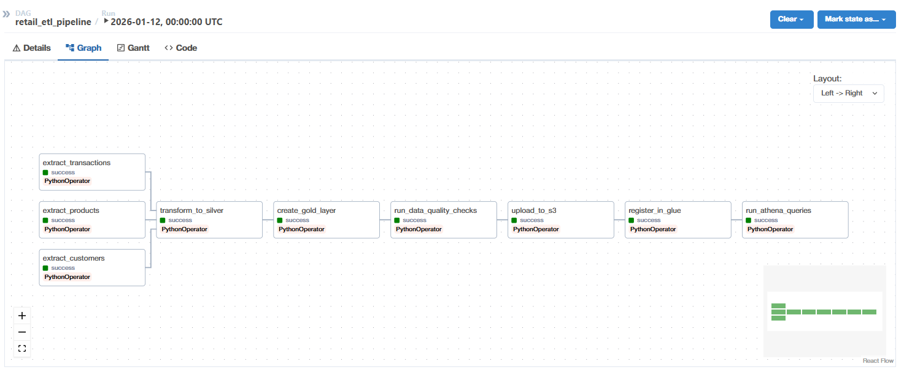
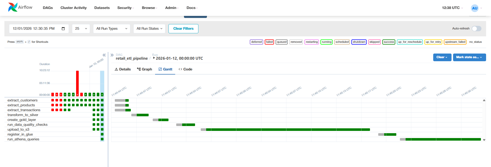

#  Retail ETL Pipeline: PostgreSQL to AWS with Airflow & Athena

[](https://www.python.org/)
[](https://airflow.apache.org/)
[](https://www.postgresql.org/)
[](https://aws.amazon.com/)

A production-ready end-to-end ETL pipeline that extracts retail data from PostgreSQL, transforms it through a Medallion Architecture (Bronze → Silver → Gold), and stores it in AWS S3 for analytics using AWS Athena.


##  Table of Contents

- [Overview](#overview)
- [Architecture](#architecture)
- [Features](#features)
- [Tech Stack](#tech-stack)
- [Project Structure](#project-structure)
- [Installation](#installation)
- [Pipeline Workflow](#pipeline-workflow)
- [Data Quality](#data-quality)
- [AWS Integration](#aws-integration)
- [Running the Pipeline](#running-the-pipeline)
- [Results](#results)
- [Future Enhancements](#future-enhancements)

##  Overview

This project implements a scalable ETL pipeline for a retail company (ShopEase) that:
- Extracts transactional data from PostgreSQL database
- Applies data quality checks and transformations
- Implements Medallion Architecture (Bronze/Silver/Gold layers)
- Uploads processed data to AWS S3
- Registers tables in AWS Glue Data Catalog
- Enables SQL analytics via AWS Athena

##  Architecture

The pipeline follows the **Medallion Architecture** pattern:

```
PostgreSQL → Bronze Layer (CSV) → Silver Layer (Parquet) → Gold Layer (Business Tables) → AWS S3 → Athena
```

### Data Flow

1. **Bronze Layer**: Raw data extracted from PostgreSQL as CSV files
2. **Silver Layer**: Cleaned and transformed data in Parquet format with partitioning
3. **Gold Layer**: Business-ready aggregated tables for analytics
4. **AWS S3**: Cloud storage for all data layers
5. **AWS Glue**: Metadata catalog for table schemas
6. **AWS Athena**: Serverless SQL query engine for analytics



##  Features

-  **Automated ETL Pipeline**: Scheduled daily runs with Apache Airflow
-  **Medallion Architecture**: Bronze → Silver → Gold data layers
-  **Data Quality Checks**: Comprehensive validation at each layer
-  **Cloud Integration**: Seamless AWS S3 upload and management
-  **Schema Registry**: Automatic table registration in AWS Glue
-  **SQL Analytics**: Query data directly with AWS Athena
-  **Monitoring**: Visual DAG monitoring and execution tracking
-  **Scalable**: Handles large datasets with Parquet compression
-  **Containerized**: Docker setup for easy deployment

##  Tech Stack

| Component | Technology |
|-----------|-----------|
| **Orchestration** | Apache Airflow 2.x |
| **Database** | PostgreSQL 13+ |
| **Data Processing** | Python 3.9+, Pandas, PyArrow |
| **Cloud Storage** | AWS S3 |
| **Data Catalog** | AWS Glue |
| **Query Engine** | AWS Athena |
| **Containerization** | Docker & Docker Compose |
| **File Formats** | CSV (Bronze), Parquet (Silver/Gold) |

##  Project Structure

```
retail-etl-pipeline-airflow-s3-athena/
├── dags/
│   ├── etl_retail_pipeline.py    # Main DAG definition
│   └── extract_test.py            # Connection test DAG
├── scripts/
│   ├── extract.py                 # PostgreSQL extraction
│   ├── transform.py               # CSV to Parquet transformation
│   ├── load.py                    # Gold layer aggregations
│   ├── data_quality.py            # Data validation checks
│   ├── aws_upload.py              # S3 upload functionality
│   ├── glue_registry.py           # Glue catalog registration
│   └── athena_queries.py          # Sample business queries
├── data/
│   ├── bronze/                    # Raw CSV files
│   ├── silver/                    # Transformed Parquet files
│   └── gold/                      # Business aggregations
├── docker/
│   ├── dags/
│   ├── logs/
│   └── scripts/
├── config/
├── logs/
└── docker-compose.yml
```

##  Installation

### Prerequisites

- Docker & Docker Compose
- AWS Account with S3, Glue, and Athena access
- AWS credentials (Access Key & Secret Key)

### Setup Steps

1. **Clone the repository**
   ```bash
   git clone https://github.com/yourusername/retail-etl-pipeline-airflow-s3-athena.git
   cd retail-etl-pipeline-airflow-s3-athena
   ```

2. **Configure AWS credentials in Airflow**
   - Access Airflow UI at `http://localhost:8080`
   - Navigate to Admin → Connections
   - Add AWS connection with ID: `aws_default`
   - Enter your AWS Access Key and Secret Key

3. **Update S3 bucket names**
   
   Edit `scripts/aws_upload.py`:
   ```python
   buckets = {
       'bronze': 'your-bronze-bucket',
       'silver': 'your-silver-bucket',
       'gold': 'your-gold-bucket'
   }
   ```

4. **Start the services**
   ```bash
   docker-compose up -d
   ```

5. **Access Airflow**
   - URL: `http://localhost:8080`
   - Username: `admin`
   - Password: `admin`

##  Pipeline Workflow



### DAG Tasks

1. **Extract Tasks** (Parallel execution)
   - `extract_customers`: Extract customer data
   - `extract_products`: Extract product catalog
   - `extract_transactions`: Extract sales transactions

2. **Transform Task**
   - `transform_to_silver`: Convert CSV to Parquet with partitioning

3. **Load Task**
   - `create_gold_layer`: Create business aggregations

4. **Quality Task**
   - `run_data_quality_checks`: Validate data at all layers

5. **AWS Tasks**
   - `upload_to_s3`: Upload all layers to S3 buckets
   - `register_in_glue`: Register tables in Glue catalog
   - `run_athena_queries`: Execute sample analytics queries

### Gold Layer Tables

| Table | Description |
|-------|-------------|
| `daily_sales_summary` | Daily revenue, orders, and items sold |
| `top_customers` | Top 10 customers by total spend |
| `product_performance` | Product sales metrics and popularity |

##  Data Quality

The pipeline includes comprehensive data quality checks:

### Bronze Layer
- File existence validation
- Row count verification
- Duplicate detection
- Null value analysis
- Column integrity checks

### Silver Layer
- Parquet file validation
- Data type verification
- Partitioning validation
- Datetime conversion checks

### Gold Layer
- Business rule validation
- Revenue positivity checks
- Aggregation accuracy
- Row count limits

##  AWS Integration

### S3 Bucket Structure

```
shopease-bronze-james/
├── customers_20260112.csv
├── products_20260112.csv
└── sale_transactions_20260112.csv

shopease-silver-james/
├── customers/date=20260112/customers_20260112.parquet
├── products/date=20260112/products_20260112.parquet
└── sale_transactions/date=20260112/sale_transactions_20260112.parquet

shopease-gold-james/
├── daily_sales_summary.parquet
├── top_customers.parquet
└── product_performance.parquet
```


### Athena Queries

Sample queries available in the pipeline:

```sql
-- Daily Revenue Analysis
SELECT 
    sale_date,
    total_orders,
    revenue,
    ROUND(revenue / total_items, 2) as avg_item_value
FROM daily_sales_summary
ORDER BY sale_date DESC
LIMIT 10;

-- Top Customers
SELECT 
    customer_id,
    total_spent,
    order_count,
    ROUND(total_spent / order_count, 2) as avg_order_value
FROM top_customers
ORDER BY total_spent DESC;

-- Product Performance
SELECT 
    product_name,
    category,
    times_sold,
    total_quantity
FROM product_performance
ORDER BY times_sold DESC
LIMIT 10;
```

##  Running the Pipeline

### Manual Trigger

1. Access Airflow UI
2. Navigate to DAGs → `retail_etl_pipeline`
3. Click the "Play" button to trigger manually

### Scheduled Runs

The pipeline runs daily at midnight UTC by default:

```python
schedule_interval='@daily'
```

### Monitoring

- View task logs in Airflow UI
- Check S3 buckets for uploaded files
- Query tables in Athena console

##  Results

### Pipeline Execution


All tasks executed successfully with the following metrics:

- **Extract Phase**: ~10,000 transactions, 1,000 customers, 600 products
- **Transform Phase**: CSV → Parquet compression ratio ~70%
- **Gold Layer**: 3 business tables with aggregated insights
- **Total Runtime**: ~10 minutes for full pipeline

### Business Insights

Daily sales trends and revenue tracking  
Top customer identification and analysis  
Product performance metrics  
Category-wise revenue breakdown

##  Future Enhancements

- [ ] Add incremental data loading
- [ ] Implement data lineage tracking
- [ ] Add real-time streaming with Kafka
- [ ] Create Tableau/PowerBI dashboards
- [ ] Add alerting for data quality failures
- [ ] Implement CI/CD pipeline
- [ ] Add data versioning with Delta Lake
- [ ] Expand to multi-region deployment

##  License

This project is licensed under the MIT License - see the LICENSE file for details.

##  Author

**Your Name**
- GitHub: [@yourusername](https://github.com/yourusername)
- LinkedIn: [Your Profile](https://linkedin.com/in/yourprofile)

##  Acknowledgments

- Apache Airflow community
- AWS documentation and best practices
- Medallion Architecture pattern by Databricks

-